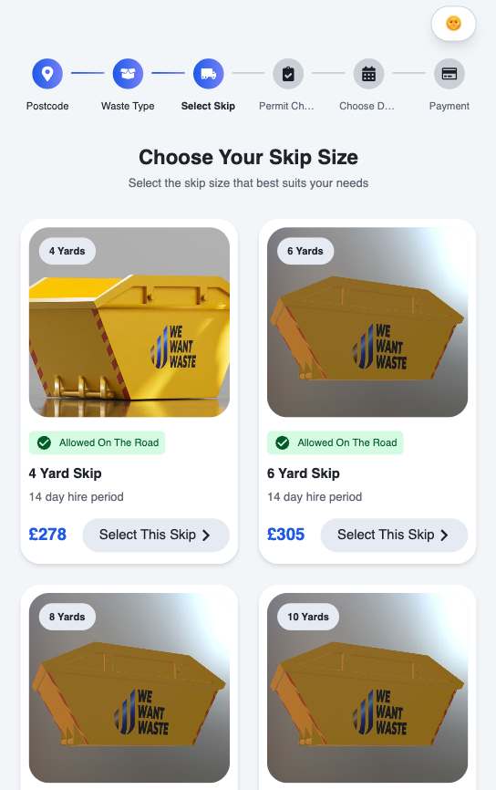

# Remwaste Skip Selection App

A modern React application for selecting skip sizes, built with Vite, Tailwind CSS, and a fully responsive, themeable UI.  
Designed for a seamless user experience with stepper navigation, skip cards, summary panel, and dark/light mode toggle.

---

## 🧩 Approach & Solution Overview

- **Mobile-first & Responsive:** UI was built with a mobile-first approach, ensuring seamless experience across all devices using Tailwind CSS utilities and custom SCSS modules where needed.
- **Component-based Architecture:** Stepper, SkipCard, SummaryCard, and ThemeToggleButton are modular and reusable, making the codebase maintainable and extensible.
- **Stepper Navigation:** Stepper configuration and icons are abstracted into a config file, allowing easy updates and clear separation of concerns.
- **Theme Support:** ThemeContext and CSS variables provide robust dark/light mode support, with system preference detection and local storage persistence.
- **API Integration:** Axios is used for data fetching, with loading states and error handling for optimal UX.
- **Accessibility:** ARIA roles and color contrast are considered for inclusive design.
- **Modern UX Details:** Animated selection, hover effects, sticky summary, and smooth transitions enhance the user experience.

## 🌐 Live Demo

[https://remwaste-murex.vercel.app/](https://remwaste-murex.vercel.app/)

---

## 🚀 Features

- **Modern UI/UX**: Responsive grid, stepper navigation, and visually rich skip cards.
- **Dark/Light Theme**: Toggleable theme with system preference detection and local storage persistence.
- **Stepper Navigation**: Modular, icon-based stepper for booking flow.
- **Skip Selection**: Interactive cards with selection logic and visual feedback.
- **Summary Panel**: Sticky/fixed summary card with contextual actions.
- **Accessibility**: ARIA roles, and high-contrast color palette.
- **Reusable Components**: Modular structure for easy extension and maintenance.
- **Loading States**: Beautiful fullscreen loader during async operations.
- **API Integration**: Fetches real skip data from a remote endpoint.

---

## 🛠️ Tech Stack

- **React** (with hooks)
- **Vite** (fast development & build)
- **Tailwind CSS** (utility-first styling)
- **SCSS Modules** (for custom components)
- **react-icons** (iconography)
- **Axios** (API requests)

---

## 📦 Getting Started

### 1. Clone the repository
```bash
git clone https://github.com/ufukcankurt/remwaste-case.git
cd remwaste-case
```

### 2. Install dependencies
```bash
yarn
```

### 3. Start the development server
```bash
yarn dev
```

### 4. Open in your browser
Visit [http://localhost:5173](http://localhost:5173) (or the port shown in your terminal).

---

## 📁 Project Structure

```
src/
  components/
    Loading/
    SkipCard/
    Stepper/
    SummaryCard/
    ThemeToggleButton/
  contexts/
    ThemeContext.jsx
  hooks/
    useWindowSize.js
  pages/
    SkipSelection/
  config/
    bookingConfig.jsx
  index.css
```

- **components/**: Reusable UI components
- **contexts/**: Theme context and provider
- **hooks/**: Custom React hooks (e.g. responsive breakpoints)
- **pages/**: Main page logic
- **config/**: Stepper and booking configuration

---

## 🌗 Theming

- The default theme follows your system preference (dark or light mode). If you have previously selected a theme, your choice is remembered and used instead.
- Toggle theme using the sun/moon button in the top right.
- All colors are managed via CSS variables for easy customization.

---

## 📝 Customization

- **Stepper steps/config**: Edit `src/config/bookingConfig.jsx`
- **Theme colors**: Edit CSS variables in `src/index.css`
- **API endpoint**: Change `FETCH_SKIP_LIST` in `src/pages/SkipSelection/SkipSelection.jsx`

## 🖼️ Screenshots


---


---


---



---

<div style="display: flex; justify-content: center; gap: 32px; height: 500px;"> 


</div>

---
